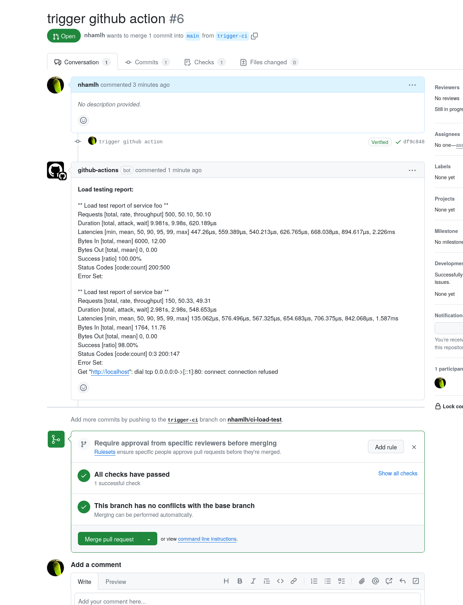
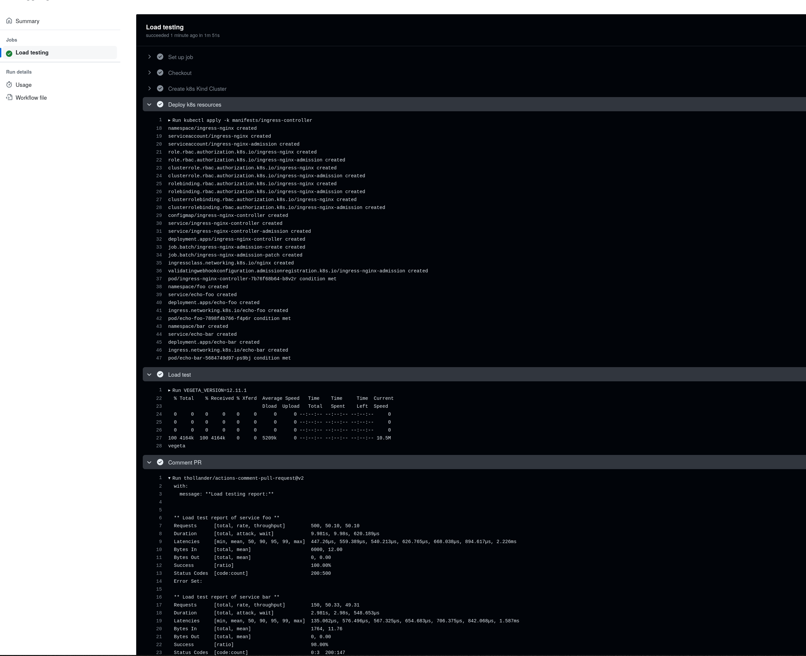

# CI workflow for http service load testing

## Getting started
Clone this repository.

Enable Github Actions (if not enabled yet).

Open a sample PR to see it in action.

## Development
This section describes my thought process to develop this application.

First, try to deliver a feature complete setup. It just need to deliver what we promise to our users: when a PR is openned, trigger a CI job to perform a load testing of http services (foo and bar as place holder services) then comment the load testing report to the PR. At this stage, code maintainability/D.R.Y/performance/etc can be compromised.

Internal enhancement: when the feature is delivered, we can continue to improve on the codebase in the background.

## Architecture

### Choices made
- nginx ingress-controller: mature, simple deployment model comparing to comparing to other ingress controllers (usually have envoy proxies accompanied by a control plane).
- kustomize: kubectl built-in, and kubectl is installed by kind-action. Simple k8s manifests rendering tool, with some level of (accepted) verbosity and repetitiveness. Therefore kustomize is sufficient for this task without the need of installing and using another tool like helm, or terraform.
- vegeta: simple and portable (single static-linked binary) thus easy to install and run; simple text-based report with enough statictics, which is easy to add as PR comment.

## TODOs
- Easily adding new service to test. Whilst the workflow is extensible, the services list is locked to (foo bar). We add a step at the top of the workflow which defines a SERVICES_DIR var and scan for sub-dir within that dir, each scanned dir is a kustomization. The step then populate the SERVICES env and subsequence steps will consume such env.

# Worklog
## Research
Duration: 35m

Create a Github repository with a basic workflow utilizing an action to post comment on PR. Also explore some tools that I wasn't familiar with like kind (I only used minikube and k3s before) and vegeta (I'm only familiar with locust).

## Working on local instance of kind cluster for faster development
Duration: 1h10

Provision kind cluster and create required k8s resources. I also tested out how to integrate vegeta with the workflow. Develop locally help speeding up the developing time.

## Feature complete workflow
Duration: 1h30

Create a complete Github Action workflow. At this stage, it's considered that the feature is complete and users can start using it. Any enhancement/optimization can happen in the background afterwards without breaking (or minimize) user experience.

## Enhancement
Duration: 2h30

Explore rooms for improvement like remove duplications, organize files better, refactor for easier reading, update README, etc.

# Sample workflow run

